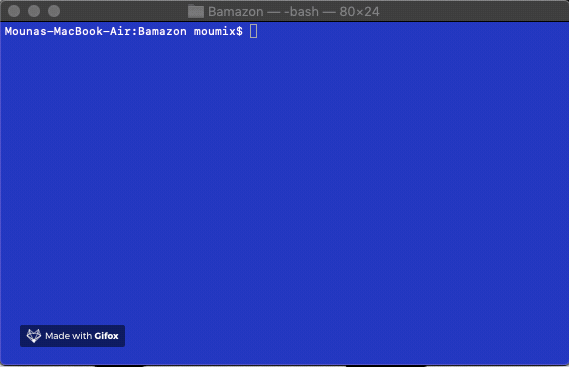
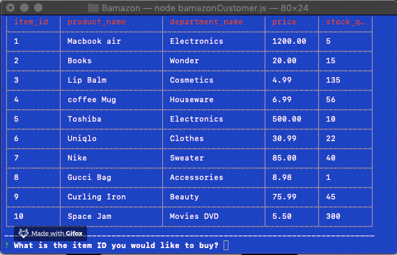
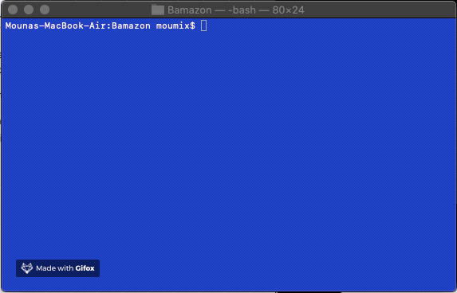
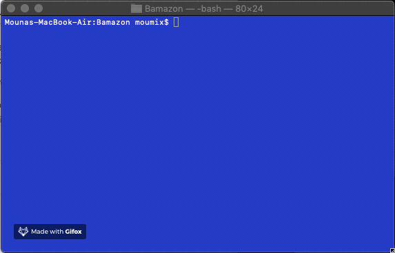
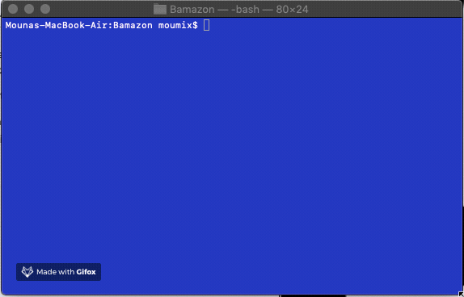
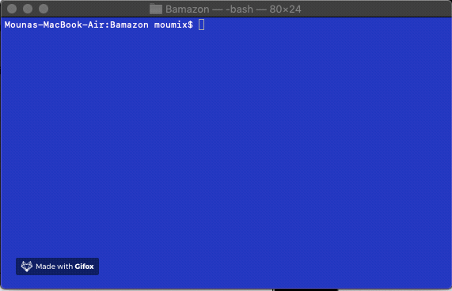
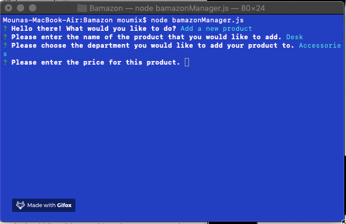
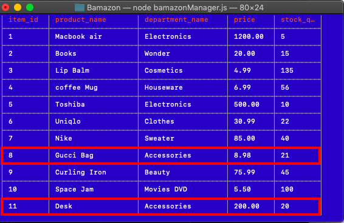

# Bamazon

###### Node.js &amp; MYSQL command line. 

Bamazon is a storefront app that takes in customers orders and depletes stock from the stores Inventory.

## Bamazon Customer will:

1. Display all of the items available for sale.

2. Prompt the users with two messages:
    - *What is the item ID they would like to buy?*
        - *how many units of the product they would like to buy?*

3. Once the customer has placed the order, the application will check if the store has enough of the product to meet the customer's request. if not it will log **_"Insufficient quantity!"_**.

4. If the store does have enough of the product, the application will fulfill the customer's order and will:
   - Updating the SQL database to reflect the remaining quantity.
   - Show the customer the total cost of their purchase.

## Demo: 

## Bamazon Manager will:

List a set of menu options:

- View Products for Sale
   - View Low Inventory
     - Add to Inventory
       - Add New Product

1.  If a manager selects `View Products for Sale`, the app should list every available item.

2. If a manager selects `View Low Inventory`, then it should list all items with an inventory count **lower than five**.

3. If a manager selects `Add to Inventory`, the app should display a prompt that will let the manager **__"add more"__** of any item currently in the store.

4. If a manager selects `Add New Product`, it should allow the manager to add a completely **new product** to the store.

## Demo:

`View Products for Sale`:

`View Low Inventory`:

`Add to Inventory`:

`Add New Product`:

# Results:

## **Technologies used:** 👩‍💻

* MySQL
* Express
* Node.js
* Cli-View
* Javascript
* NPM packages *(mysql, inquirer)*